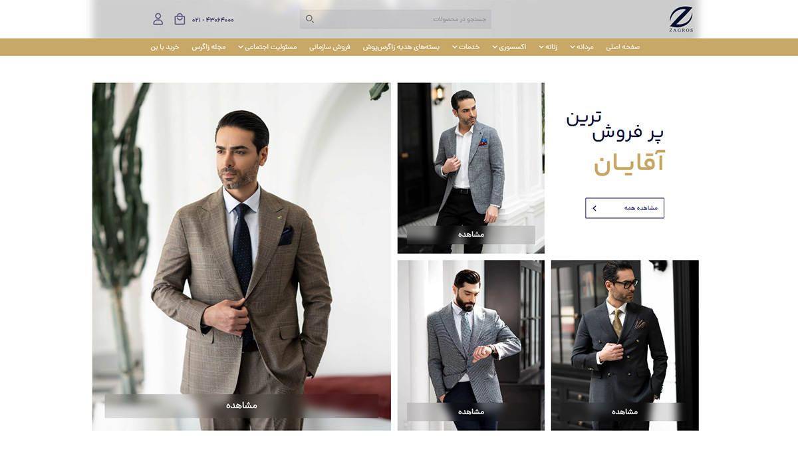
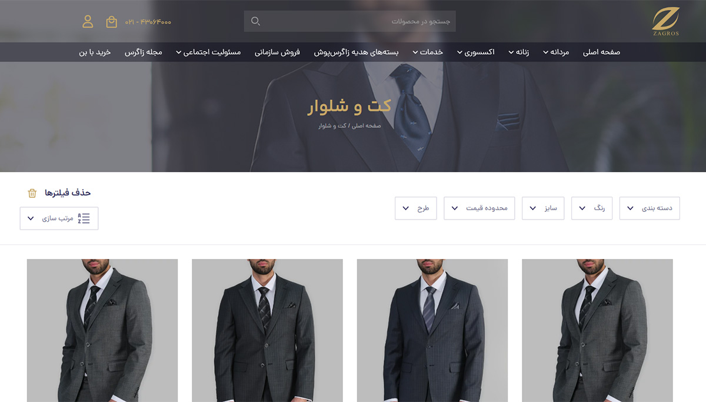
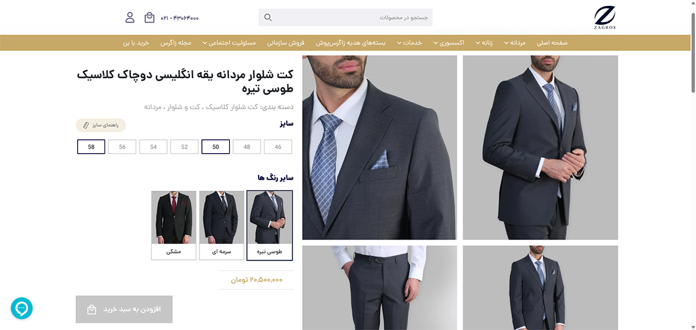
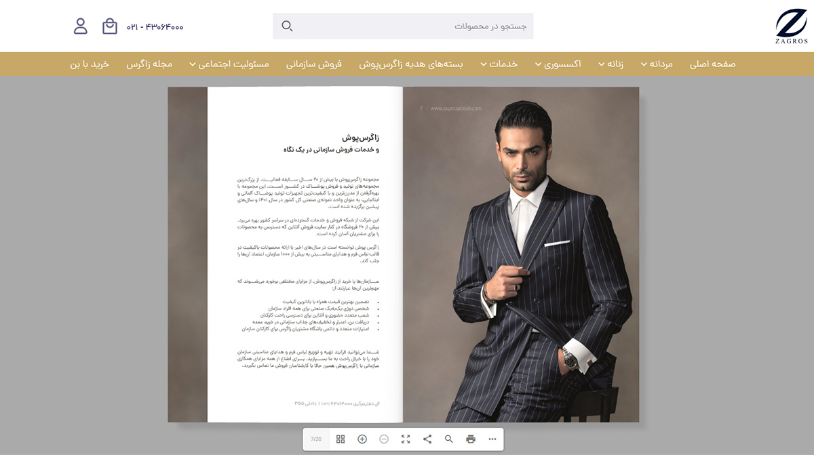
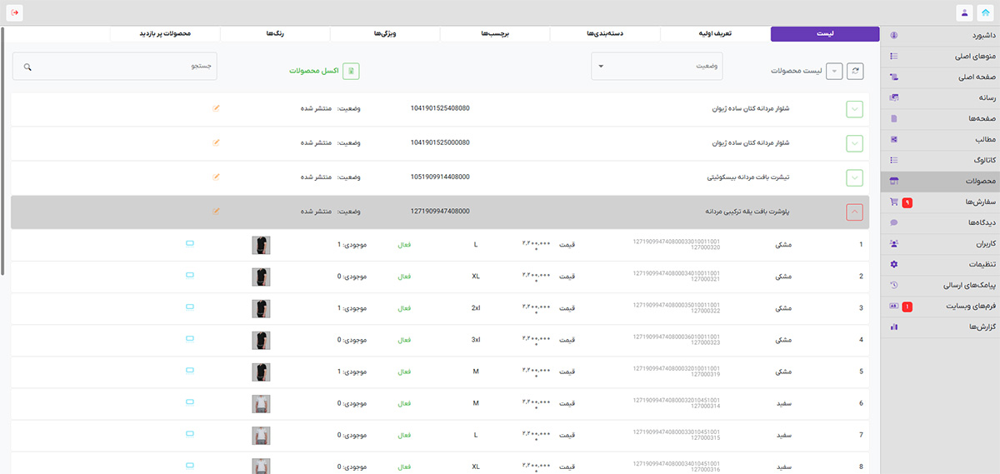
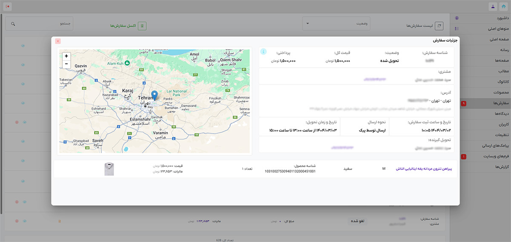
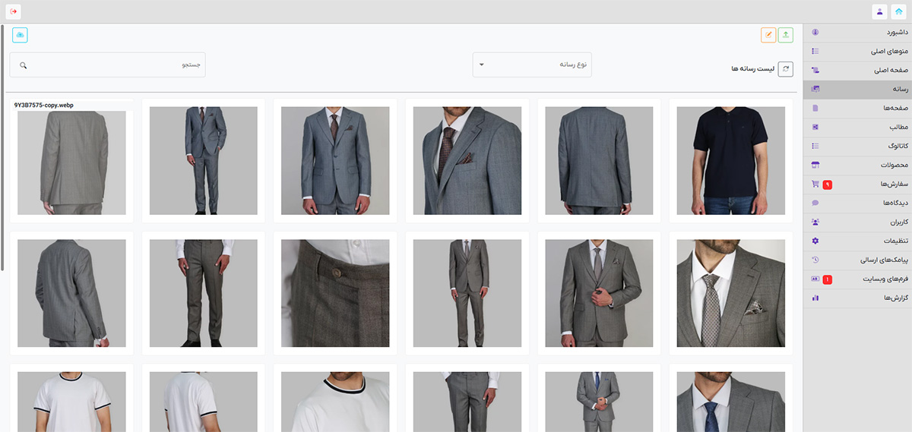

# Zagrospoosh Online Store (Showcase)

This repository showcases the development of a custom e-commerce website for **Zagrospoosh**, a leading Iranian manufacturer of formal wear and suits.

🔗 **Live Website:** [https://zagrospoosh.com](https://zagrospoosh.com)

---

## 🏢 About the Client

Zagrospoosh is a clothing manufacturer based in Tehran with multiple retail branches across Iran. Their operations are managed via the **Rahkaran ERP** system.

---

## ⚙️ Project Overview

The project involved building a custom online store using **WordPress** and **WooCommerce**, tightly integrated with Zagrospoosh’s **ERP system (Rahkaran)**. Key features and integrations:

- **Product Syncing with ERP:**
  - Product creation, price lookup, and real-time stock checks via web services.
  - Internal coding system maps ERP product codes to WooCommerce product variations (size/color).
  - Cron jobs every 15 minutes to sync product prices and stock.

- **Custom Angular Admin Panel:**
  - Built to provide a clean, focused interface for content managers.
  - Connected to WordPress backend via REST APIs.
  - Features include:
    - Product & variation management
    - Media & catalog uploads
    - Home page content management
    - Menu management (header/footer)
    - Custom post type for PDF catalogs
    - Page editing
    - Order & user management
    - Comment & SMS logs management

- **Website Frontend:**
  - Fully custom theme built using **PHP** and **jQuery**
  - Optimized for performance and mobile responsiveness

---

## 🧑‍💻 Stack

| Layer         | Tech                       |
|---------------|----------------------------|
| CMS           | WordPress + WooCommerce    |
| Frontend Site | PHP + jQuery               |
| Admin Panel   | Angular                    |
| Backend API   | Custom PHP (REST)          |
| ERP           | Rahkaran ERP (Web Services) |

---

## 📸 Screenshots

### 🔹 Website Frontend

**Homepage**  

**Shop Page**  

**Product Page**  

**Catalog Section (PDF)**  

---

### 🔹 Admin Panel (Angular)

**Products Management**  

**Orders Management**  

**Media Library**  

---

## 🔒 Note

Due to the proprietary nature of this project, **source code is not publicly available**. This repository serves only as a portfolio showcase.

---

## 👨‍💻 Authors

- **Frontend (Client Website)** and **Backend (Admin APIs):** [Amir Navidfar](https://github.com/amirhsnf)
- **Admin Panel UI (Angular):** Arman Molaei
